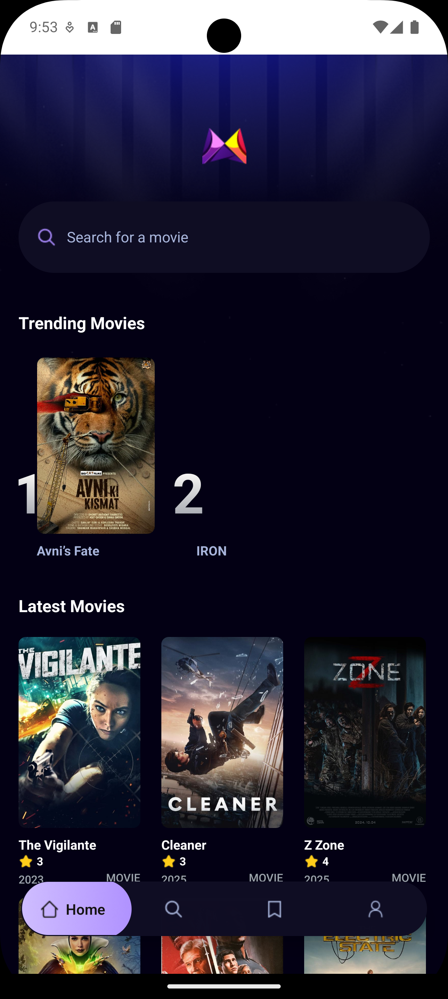
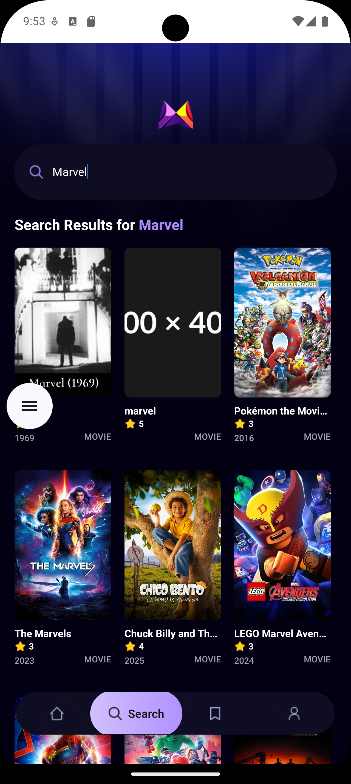
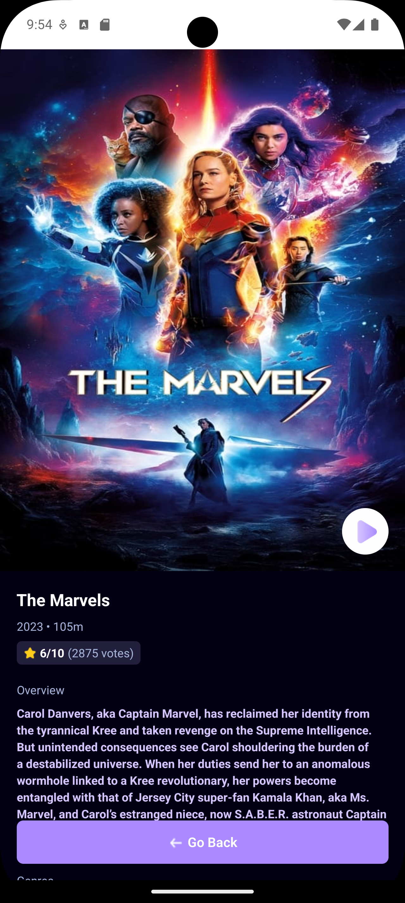
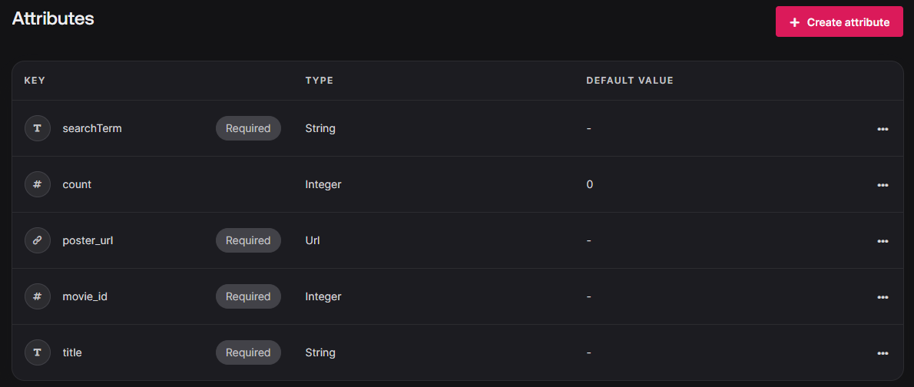

# Demo

   
   
   

# Setup

- [TMDB](https://developer.themoviedb.org/reference/intro/getting-started): TMDB api used to get movies data
- [Appwrite](https://appwrite.io): Appwrite used to store data
